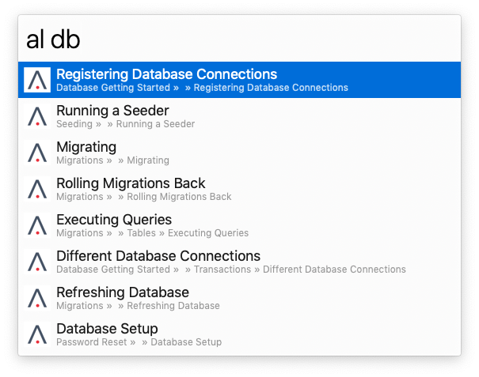

# [Alpas Docs](https://alpas.dev/docs) Workflow for Alfred

Alpas docs search workflow for Alfred.



## Installation

1. [Download the latest version](https://github.com/alpas/docs-alfred-workflow/releases/download/v1.0.0/AlpasDocs.alfredworkflow)
2. Double-click the `.alfredworkflow` file to install it.
3. Add the workflow to a category, then click `Import`.

## Usage

Type `al` followed by a search term to see the result. While selected, hit `⌘+y` for quickly viewing the documentation of the selected search result or hit enter to browse it online.

```
al <query>
```


